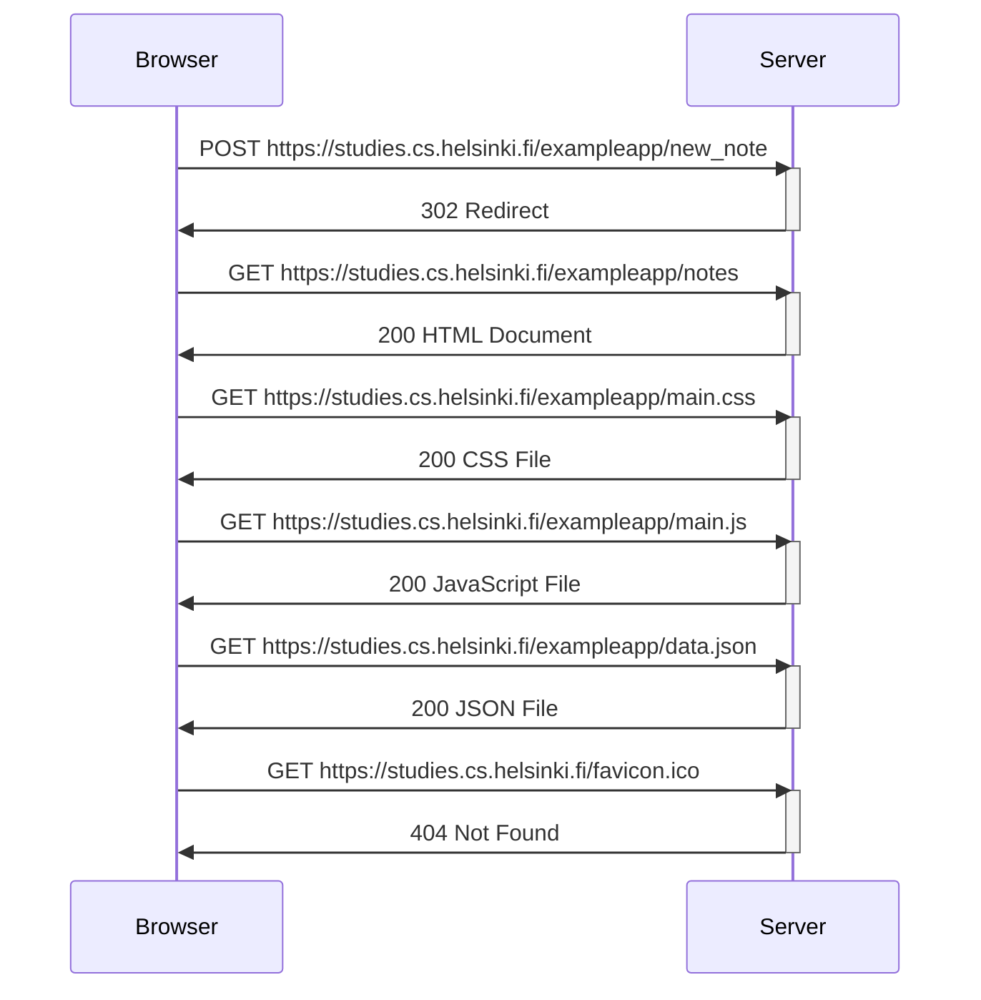

```mermaid
  sequenceDiagram
  participant Browser
  participant Server

  Browser->>Server: POST https://studies.cs.helsinki.fi/exampleapp/new_note
  activate Server
  Server->>Browser: 302 Redirect
  deactivate Server

  Browser->>Server: GET https://studies.cs.helsinki.fi/exampleapp/notes
  activate Server
  Server->>Browser: 200 HTML Document
  deactivate Server

  Browser->>Server: GET https://studies.cs.helsinki.fi/exampleapp/main.css
  activate Server
  Server->>Browser: 200 CSS File
  deactivate Server

  Browser->>Server: GET https://studies.cs.helsinki.fi/exampleapp/main.js
  activate Server
  Server->>Browser: 200 JavaScript File
  deactivate Server

  Browser->>Server: GET https://studies.cs.helsinki.fi/exampleapp/data.json
  activate Server
  Server->>Browser: 200 JSON File
  deactivate Server

  Browser->>Server: GET https://studies.cs.helsinki.fi/favicon.ico
  activate Server
  Server->>Browser: 404 Not Found
  deactivate Server


```
